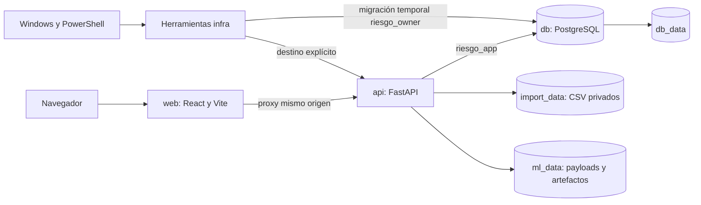
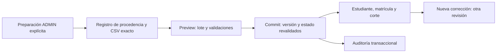
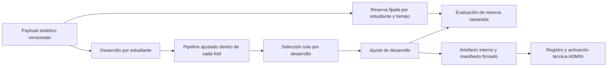
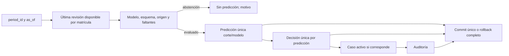
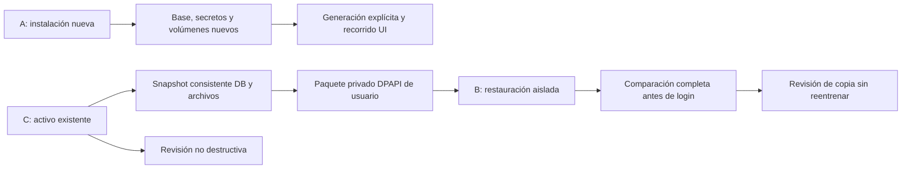

# Arquitectura final local

Seguimiento Escolar es un monorepo para **simulación local con origen SYNTHETIC**.
Windows/PowerShell coordina Docker Desktop; Linux existe dentro de las imágenes.
No exige Bash, Make, una distribución WSL, GPU o servicios de IA pagados al operador.
REAL permanece bloqueado. La arquitectura no acredita validación escolar o académica.

Decisiones: [ADR 004](../adr/004-transicion-windows.md),
[005](../adr/005-infraestructura-ml-s3.md),
[006](../adr/006-estudio-sintetico-s3-1.md),
[007](../adr/007-interfaz-s4.md),
[008](../adr/008-seguimiento-reportes-s5.md) y
[009](../adr/009-integracion-recuperacion-s6.md).
Los resultados efectivos del cierre están en [Estado S6](../planning/Estado_Sprint_6.md)
y la [matriz final](Matriz_Trazabilidad_Final.md), separados de esta descripción.

## Componentes y persistencia

React/TypeScript/Tailwind presentan datos; TanStack Query administra consultas por
actor/rol/contexto/filtros. FastAPI separa rutas, schemas, servicios y repositorios.
SQLAlchemy/psycopg acceden a PostgreSQL. Alembic aplica revisiones manuales; no hay
autogeneración sobre metadata parcial, create_all ni migración/semilla al arrancar
la API. `manage up` coordina explícitamente el migrador temporal antes de arrancar.

| Recurso | Función | Versión o revisión conservada |
| --- | --- | --- |
| Python de backend | API, servicios y núcleo ML en Docker | 3.12.12 |
| PostgreSQL | Transacciones, integridad, locks y evidencias | 17.6 |
| Node/npm de imagen | Frontend y build | 24.14.1 / 11.20.0 |
| OpenAPI | Campos/operaciones públicas y tipos frontend | 0.5.0, 27 operaciones |
| Alembic | Esquema versionado | 0004_followup, 15 tablas de aplicación |
| ML CPU | Dummy, Random Forest, SVM y XGBoost | scikit-learn 1.9.1; xgboost-cpu 3.4.1 |

Los otros pins/hashes permanecen en package-lock y requirements. Las versiones
efectivamente ejecutadas y hashes del checkout/locks/imágenes se documentan en el
cierre; un tag o HEAD aislado no identifica todos los cambios locales.

Proyecto activo: riesgo-escolar, DB riesgo_escolar; puertos host loopback
15173/18000/55432. Volúmenes db_data/import_data/ml_data del proyecto. La web local
usa Vite con proxy; no es una declaración de despliegue institucional con TLS.
Las copias S6 usan otros proyectos, bases, tres volúmenes y puertos libres con
identidad explícita; no se modifica una constante global para apuntar al activo.

## Autenticación y autorización

Cookie session HttpOnly, SameSite=Lax, Secure bajo HTTPS. Servidor almacena digest
SHA-256 de sesión/CSRF, contraseña Argon2 y revocación/expiración. Login exige Origin
autorizado y límite de 10 intentos por IP/correo cada 300 segundos. Logout revoca y
audita atómicamente. El navegador mantiene CSRF solo en memoria, cancela peticiones
y limpia caché/borradores al terminar o cambiar sesión; no guarda tokens en storage.

El servidor vuelve a consultar usuario activo/rol y filtra cada recurso por sección.
ADMIN importa/evalúa/sincroniza y gestiona; TUTOR consulta/gestiona/exporta sus
secciones; DIRECTOR consulta/exporta; RESEARCHER conserva sesión/Inicio limitado.
No hay RLS ni conexión DB por persona: la API usa riesgo_app con privilegios mínimos.
Owner se reserva para migración/recuperación. Ningún X-Role o checkbox habilita REAL.

Un perfil de operador Windows permite autenticar ADMIN contra un destino explícito
sin depender de las cuatro credenciales de revisión S2.2. Registrar un perfil no
crea una cuenta. El bootstrap de una instalación nueva solicita los valores privados
del operador. Consulta el [manual Windows](Manual_Instalacion_Windows.md).

## CSV y evidencia académica

Solo el CSV exacto del estudio registrado entra al flujo SYNTHETIC. Preview guarda
lote/archivo/metadatos sin filas académicas; commit exige expected_preview_version,
revalida estado y confirma entidades/auditoría/bindings en una transacción.
Archivo/periodo repetidos reutilizan resultado. Errores invalidan todo el lote;
conflicto stale devuelve 409 sin escrituras parciales. Las correcciones del motor
crean revisiones, sin sobrescribir evidencia. El protocolo sintético actual no
autoriza ediciones manuales de su archivo exacto.

CSV privado fuera del checkout, con identificador interno, creación exclusiva y
hash verificado. Límite 5 MiB/10000 filas, UTF-8, tipos/escalas/precisión/fechas,
faltantes null y missing_fraction servidor. Fechas DATE se comparan en Lima;
instantes UTC. REAL devuelve INSTITUTIONAL_PROCESSING_NOT_READY antes de guardar.

## Núcleo predictivo y simulación

Código ML en app/ml/features/train/evaluate/predict. Estimadores solo reciben
promedio, asistencia, actividades, participación e incidencias. Edad/grado
requieren justificación explícita; están excluidos del predictor sintético vigente.
UUID/códigos/sección/tutor/fechas técnicas/etiquetas/resultados posteriores quedan
fuera de X. Metadatos temporales permiten verificar corte, disponibilidad y horizonte.

Las particiones separan estudiantes; varios cortes no multiplican el tamaño
independiente. Imputación/codificación/escala se ajustan en train/fold. SVM incorpora
escala, sin probability=True ni calibración implícita. Mismos splits para los cuatro
algoritmos; folds efectivos según soporte. Selección por macro-F1 de desarrollo,
luego balanced accuracy y orden fijo; reserva excluida de fit/selección. Métricas
sin soporte se expresan como no estimables. No tuning o exactitud mínima.

Dataset/manifiesto/hash/parámetros/versiones/particiones/métricas y procedencia
se conservan privados. Antes de deserializar: ruta interna, ausencia de symlinks,
HMAC, hashes, esquema/clases/versiones. XGBoost conserva además UBJSON y su
preprocesamiento. No se permite cargar joblib/pickle externos por usuarios.

Comparar/registrar/activar son CLI ADMIN explícitas, nunca trabajo al iniciar o una
petición HTTP. El modelo activo actual se conserva, sin reentrenarlo en S6.
TECHNICAL_SIMULATION no acredita aprobación escolar. Manuales detallados:
[núcleo ML](ML_S3.md) y [estudio sintético](Manual_Estudio_Sintetico.md).

## Inferencia y seguimiento transaccionales

Selección exige cutoff/available/created<=as_of y modelo disponible para ese instante.
Nueva revisión queda pendiente; no hereda la predicción anterior. Sin modelo o datos
suficientes conserva motivo/abstención, nunca LOW. Probabilidades públicas null y
probabilities_calibrated=false. El pipeline de inferencia es el entrenado.

followup-policy-v1: MEDIUM/HIGH actuales crean/actualizan un caso; LOW conserva el
caso humano previo o NO_ALERT. Una decisión persistida evita duplicación/reapertura
al repetir. Nueva predicción posterior puede abrir otro caso conservando historia.
No se retrocede fuente con una ejecución histórica; se cuenta ignored_stale.

Orden de locks: periodo FOR SHARE, modelo compartido y matrículas por UUID antes
de recursos de seguimiento. Restricciones DB de unicidad/procedencia/versiones y
triggers apoyan los servicios. Cerrar periodo serializa con escrituras. Casos y
actividades terminales se conservan; el cierre humano no completa actividades.

Actividades usan versión y UUID de intención por actor, digest del payload original;
repetir el mismo intento reutiliza aun después de editarlo. Un resultado incierto
no se reintenta automáticamente. Cambios/auditoría se confirman juntos.

## Lecturas, indicadores y exportación

Estudiantes/resumen/CSV comparten selección actual compatible. Riesgo solo de
evaluados; total=evaluados+pendientes+insuficientes. Una matrícula por unidad;
casos/actividades se agregan antes de joins, sin multiplicar denominadores.
Filtros/alcance se aplican en servidor. Items paginados; resumen del conjunto entero.

CSV completo filtrado, UTF-8 BOM, 19 columnas, quoting y protección de fórmulas/
controles en proyección. Sin narrativas o ML privado. Nombre fijo/no-store;
audita solicitud, no apertura. 503 de exportación es JSON Error, no falso CSV.
Timeline conserva eventos históricos sanitizados y paginados. No se infiere eficacia.

## Tres pruebas distintas de S6

A prueba instalación desde cero; B recupera el estado actual desde dump/archivos/
configuración, incluida la clave HMAC, sin generador; C conserva el activo.
Persistencia al recrear contenedores no equivale a recuperación desde respaldo.
DPAPI vincula la recuperación al perfil/equipo Windows y sus condiciones de
recuperación; no se promete portabilidad. Backup no exporta Credential Manager.
La copia usa riesgo_app y conserva ownership/grants restaurados. Verificación previa
al login incluye todas las tablas, Alembic, sesiones, auditoría y archivos; accesos
posteriores agregan legítimamente sesiones/auditoría y se distinguen de pérdida.

Las pruebas reales y pendientes, incluida caída DB solo aislada y capturas
inspeccionadas, se declaran en la matriz/cierre. Este diagrama no acredita su éxito.
Consulta [respaldo/restauración](Manual_Respaldo_Restauracion.md),
[mapa API](Mapa_Endpoints.md) y [diccionario DB](Diccionario_Base_Datos.md).

La [restauración estructural S6](../../tests/evidence/s6-restore-final-code.json)
comprobó antes del login todas las huellas de las 15 tablas, Alembic y los 17
archivos privados en `s6-restore-a3a22654c1a2`. Conservó SVM, HMAC y compatibilidad
sin generar, reentrenar, firmar o activar otra vez. Las
[seis pruebas negativas del paquete real](../../tests/evidence/s6-backup-negative-final.json)
rechazaron alteración DPAPI nativa Windows, HMAC ausente, manifiesto incompatible,
dump modificado, copia no registrada y destino existente; el backup original quedó
intacto. Es evidencia de recuperación estructural y protección, separada del cierre
de interfaz y de instalación nueva.
